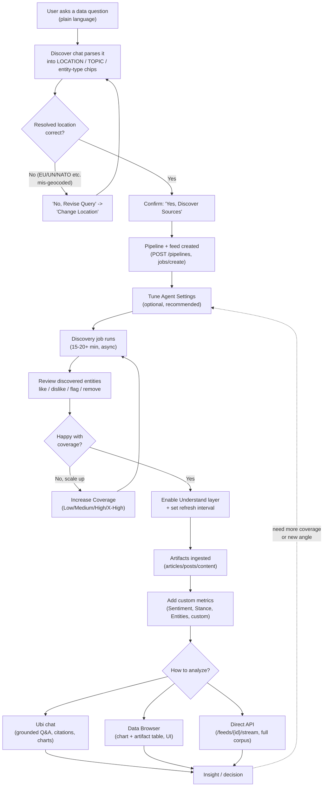
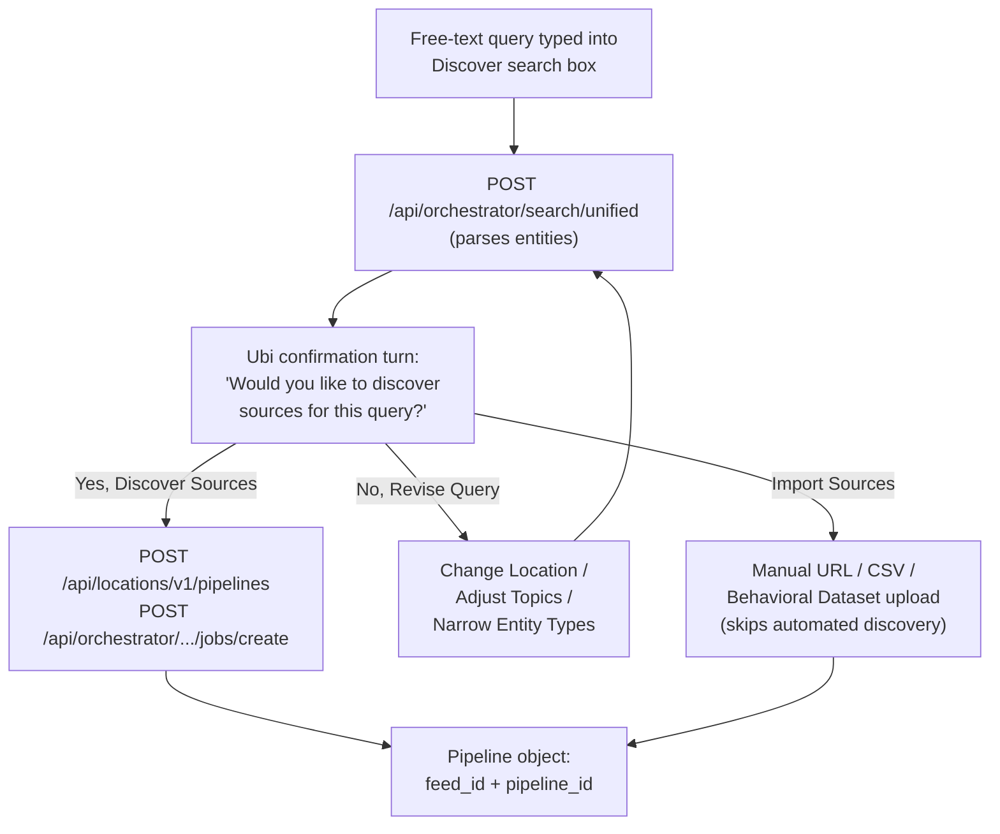
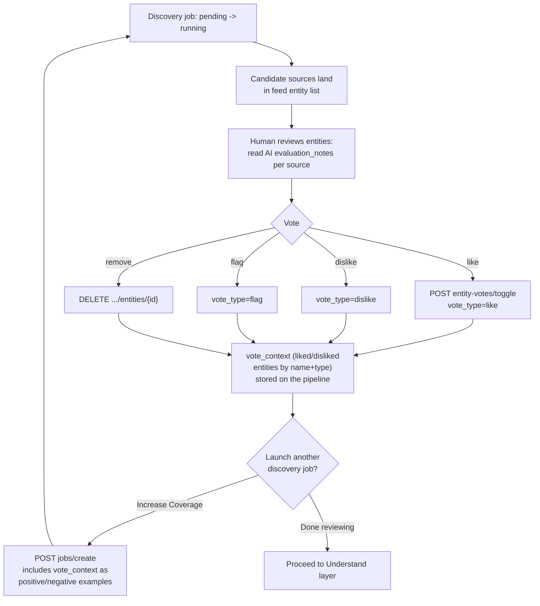
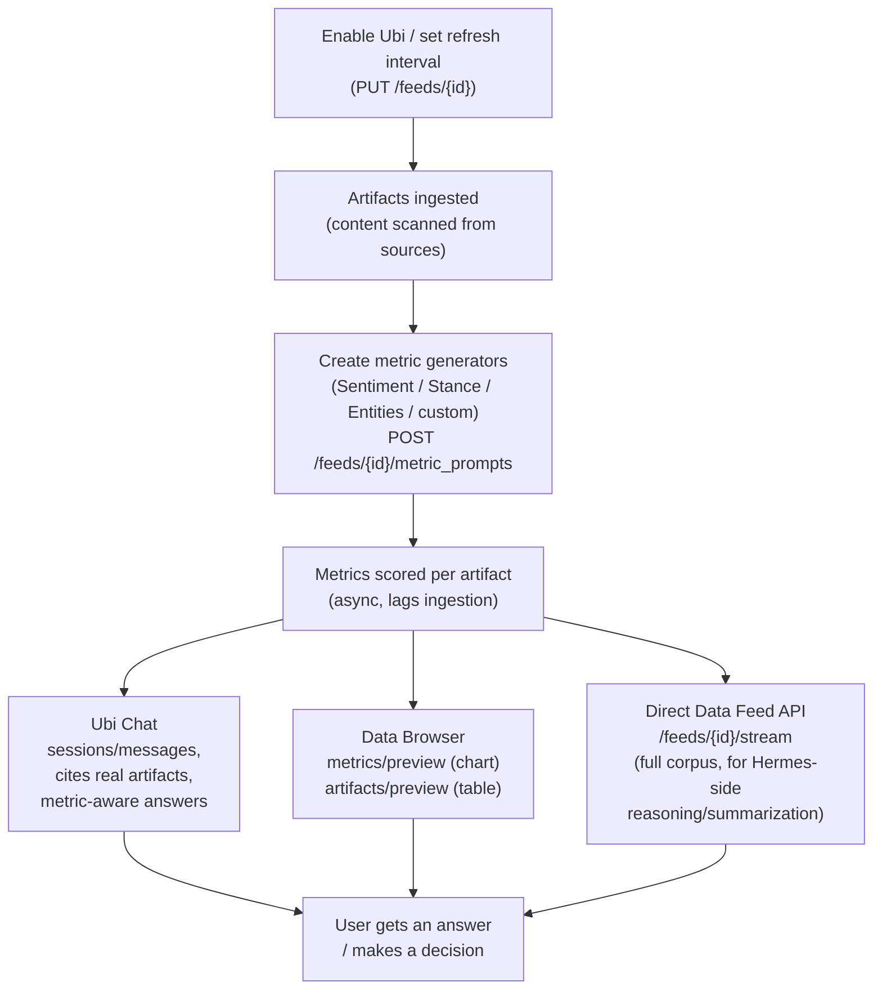
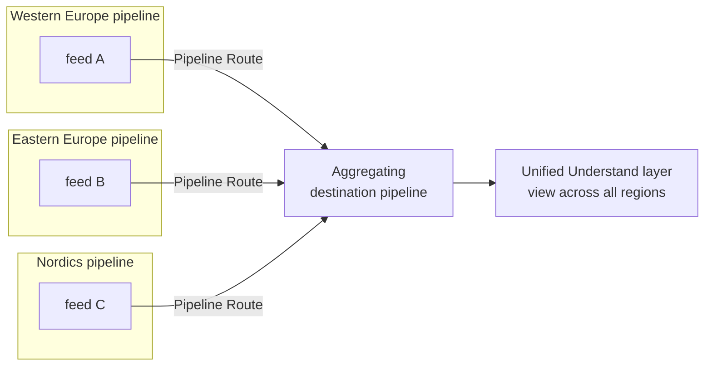

# Ubiquity workflow -- Mermaid flowcharts

These render in any Mermaid-compatible viewer (GitHub, Obsidian, Mermaid Live Editor, etc).

## 1. End-to-end overview

## 2. Pipeline creation detail (Discover chat)

## 3. Discovery job + entity review loop

## 4. Understand layer + analysis fan-out

## 5. Multi-pipeline routing (large/geographically broad queries)

